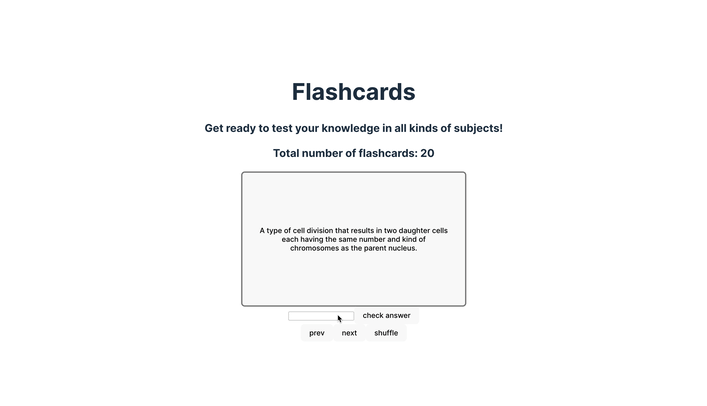

# Web Development Project 2 - *Flashcards*

Submitted by: **Nell Brodkin**

This web app: **allows a user to go through virtual flashcards**

Time spent: **8** hours spent in total

## Required Features

The following **required** functionality is completed for part 1:

- [x] **The title of the card set and some information about it, such as a short description and the total number of cards are displayed**
- [x] **A single card at a time is displayed, only showing one of the components of the information pair**
- [x] **A list of card pairs is created**
- [x] **Clicking on the card shows the corresponding component of the information pair**
- [x] **Clicking the next button displays a random new card**

The following **required** functionality is completed for part 2:

- [x] **The user can enter their guess in a box before seeing the flipside of the card**
- [x] **Clicking on a submit button shows visual feedback about whether the answer was correct or incorrect**
- [x] **A back button is displayed on the card and can be used to return to the previous card in a set sequence**
- [x] **A next button is displayed on the card and can be used to navigate to the next card in a set sequence**

The following **optional** features are implemented:

- [x] A shuffle button is used to randomize the order of the cards

No additional features are implemented

## Video Walkthrough

Here's a walkthrough of implemented required features:

<!-- Replace this with whatever GIF tool you used! -->
GIF created with [Kap](https://getkap.co/)  
<!-- Recommended tools:
[Kap](https://getkap.co/) for macOS
[ScreenToGif](https://www.screentogif.com/) for Windows
[peek](https://github.com/phw/peek) for Linux. -->

## Notes

The biggest challenge with this project was creating the card-flipping animation.
